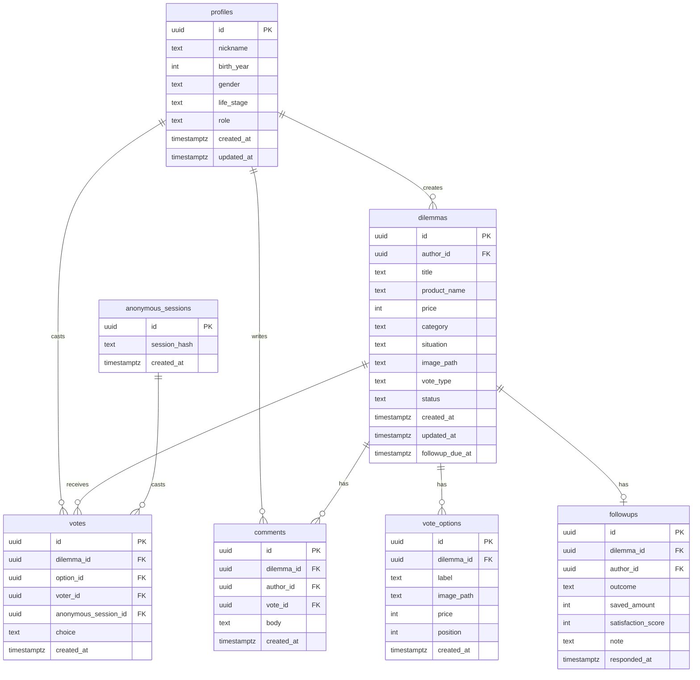

# PickIt — Entity Relationship Diagram

> Supabase/Postgres 기준 데이터 모델과 권한 경계를 정의한다.
> 구현 시 migration SQL과 타입 생성 결과가 이 문서와 일치해야 한다.

---

## 1. 엔티티 맵



---

## 2. 상태 모델

### DilemmaStatus

```ts
type DilemmaStatus =
  | "draft"
  | "open"
  | "decided"
  | "followup_due"
  | "followed_up"
  | "archived";
```

전이:

```text
draft -> open -> decided -> followup_due -> followed_up
open -> followup_due
open|decided|followup_due|followed_up -> archived
```

### VoteChoice

```ts
type VoteChoice = "buy" | "skip";

type VoteType = "buy_skip" | "ab";
```

### FollowupOutcome

```ts
type FollowupOutcome = "bought" | "skipped";
```

---

## 3. 테이블 정의

### profiles

Supabase Auth 사용자와 1:1 매핑된다.

| 컬럼 | 타입 | 제약 |
| --- | --- | --- |
| id | uuid | PK, references auth.users(id) |
| nickname | text | not null, 2~24자 |
| birth_year | int | nullable |
| gender | text | nullable |
| life_stage | text | nullable |
| role | text | not null, default 'user', in `user`, `operator` |
| created_at | timestamptz | default now() |
| updated_at | timestamptz | default now() |

### dilemmas

| 컬럼 | 타입 | 제약 |
| --- | --- | --- |
| id | uuid | PK, default gen_random_uuid() |
| author_id | uuid | not null, references profiles(id) |
| title | text | not null, 2~80자 |
| product_name | text | not null, 1~80자 |
| price | int | not null, price > 0 |
| category | text | not null |
| situation | text | not null, 10~1000자 |
| image_path | text | nullable |
| vote_type | text | not null, default 'buy_skip' |
| status | text | not null, default 'open' |
| created_at | timestamptz | default now() |
| updated_at | timestamptz | default now() |
| followup_due_at | timestamptz | generated or set to created_at + interval '7 days' |

인덱스:

- `(status, created_at desc)`
- `(author_id, created_at desc)`
- `(category, created_at desc)`
- `(followup_due_at)` where status in `open`, `decided`

### votes

| 컬럼 | 타입 | 제약 |
| --- | --- | --- |
| id | uuid | PK |
| dilemma_id | uuid | not null, references dilemmas(id) on delete cascade |
| option_id | uuid | nullable, references vote_options(id) |
| voter_id | uuid | nullable, references profiles(id) |
| anonymous_session_id | uuid | nullable, references anonymous_sessions(id) |
| choice | text | nullable, in `buy`, `skip` |
| created_at | timestamptz | default now() |

불변성:

- `voter_id` 또는 `anonymous_session_id` 중 하나는 반드시 존재한다.
- `buy_skip` 투표는 `choice`가 존재하고 `option_id`는 null이다.
- `ab` 투표는 `option_id`가 존재하고 `choice`는 null이다.
- 한 고민에 대해 같은 `voter_id`는 한 번만 투표한다.
- 한 고민에 대해 같은 `anonymous_session_id`는 한 번만 투표한다.
- 작성자는 자기 고민에 투표할 수 없다.

인덱스/제약:

- unique `(dilemma_id, voter_id)` where voter_id is not null
- unique `(dilemma_id, anonymous_session_id)` where anonymous_session_id is not null

### vote_options

A/B 투표 옵션을 저장한다. `buy_skip` 투표는 옵션 row를 만들지 않는다.

| 컬럼 | 타입 | 제약 |
| --- | --- | --- |
| id | uuid | PK |
| dilemma_id | uuid | not null, references dilemmas(id) on delete cascade |
| label | text | not null, 1~80자 |
| image_path | text | nullable |
| price | int | nullable, price > 0 |
| position | int | not null, in 1, 2 |
| created_at | timestamptz | default now() |

제약:

- unique `(dilemma_id, position)`
- A/B 투표 하나에는 position 1, 2가 있어야 한다.

### comments

| 컬럼 | 타입 | 제약 |
| --- | --- | --- |
| id | uuid | PK |
| dilemma_id | uuid | not null, references dilemmas(id) on delete cascade |
| author_id | uuid | nullable, references profiles(id) |
| vote_id | uuid | not null, unique, references votes(id) on delete cascade |
| body | text | not null, 1~200자 |
| created_at | timestamptz | default now() |

MVP에서는 댓글을 "투표 한마디"로 제한한다. 독립 댓글 스레드는 후속으로 미룬다.

불변성:

- `comments.vote_id`는 같은 `dilemma_id`의 vote를 가리켜야 한다.
- 한 vote에는 한 개의 comment만 연결된다.
- 인증 사용자 comment는 `author_id = auth.uid()`를 저장한다.
- 익명 comment는 `author_id`가 null일 수 있지만 반드시 `anonymous_session_id`가 있는 vote에 연결돼야 한다.
- MVP에서 익명 comment는 생성 후 수정/삭제하지 않는다.

### followups

| 컬럼 | 타입 | 제약 |
| --- | --- | --- |
| id | uuid | PK |
| dilemma_id | uuid | not null, unique |
| author_id | uuid | not null |
| outcome | text | not null, in `bought`, `skipped` |
| saved_amount | int | not null, default 0 |
| satisfaction_score | int | nullable, 1~5 |
| note | text | nullable, <= 500자 |
| responded_at | timestamptz | default now() |

불변성:

- `author_id`는 `dilemmas.author_id`와 같아야 한다.
- `outcome = skipped`이면 `saved_amount = dilemmas.price`.
- `outcome = bought`이면 `saved_amount = 0`.

### anonymous_sessions

| 컬럼 | 타입 | 제약 |
| --- | --- | --- |
| id | uuid | PK |
| session_hash | text | not null unique |
| created_at | timestamptz | default now() |

---

## 4. View / RPC

### dilemma_vote_summaries

고민별 투표 집계 view.

| 컬럼 | 타입 |
| --- | --- |
| dilemma_id | uuid |
| buy_count | int |
| skip_count | int |
| option_a_count | int |
| option_b_count | int |
| total_count | int |
| buy_ratio | numeric |
| skip_ratio | numeric |

`option_a_count`/`option_b_count`는 `vote_options.position = 1/2` 기준으로 계산한다. `buy_skip` 투표에서는 0이다.

### get_followup_candidates(now timestamptz)

현재 authenticated author의 고민 중 `followup_due_at <= now`이고 아직 followup이 없는 고민을 반환한다. 프로필/소비기록 prompt에서 사용한다.

### get_my_notification_candidates()

현재 authenticated author에게 보여줄 앱 내 알림 후보를 반환한다. 결과 확인 후보와 회고 후보를 포함한다.

### get_operator_notification_candidates()

결과 알림 후보와 회고 알림 후보를 반환한다. MVP에서는 실제 외부 발송 없이 앱 내 알림/수동 운영 후보로만 사용한다.

### cast_vote(...)

중복 투표와 작성자 자기 투표 방지를 한 곳에서 처리하는 RPC를 고려한다. MVP에서는 서버 액션 + DB constraint로 시작 가능하다.

---

## 5. RLS 초안

### profiles

- select: authenticated users can read public profile fields
- insert/update: `auth.uid() = id`
- `role = 'operator'` 부여는 service role 또는 관리 스크립트만 가능하다.

### dilemmas

- select: `status in ('open', 'decided', 'followup_due', 'followed_up')`
- insert: authenticated, `auth.uid() = author_id`
- update/delete: `auth.uid() = author_id`

### votes

- select: public for open dilemmas
- insert: authenticated or valid anonymous session
- update/delete: disallow in MVP

### comments

- select: public for open dilemmas
- insert: authenticated or vote-linked anonymous flow
- update/delete: authenticated author only. Anonymous vote-linked comments are immutable in MVP.

### followups

- select: author only for detailed note, aggregate saved amount can be public later
- insert: `auth.uid() = author_id`
- update: author only within limited window

### operator RPC

- `profiles.role = 'operator'`인 사용자만 운영자 후보 조회 RPC(`get_operator_notification_candidates`)를 호출할 수 있다.
- 일반 authenticated user와 anon은 운영자 RPC 호출이 거부된다.
- `get_followup_candidates`, `get_my_notification_candidates`는 현재 authenticated user의 `author_id = auth.uid()` 범위만 반환한다.

---

## 6. 계산 규칙

### 투표 비율

```ts
buyRatio = total === 0 ? 0 : Math.round((buyCount / total) * 100);
skipRatio = total === 0 ? 0 : 100 - buyRatio;
```

### 회고 예정일

```ts
followupDueAt = createdAt + 7 days;
```

### 절약 금액

```ts
savedAmount = outcome === "skipped" ? dilemma.price : 0;
```

---

## 7. 마이그레이션 순서

1. enums/check constraints
2. profiles
3. dilemmas
4. anonymous_sessions
5. vote_options
6. votes
7. comments
8. followups
9. views/RPC
10. RLS policies
11. seed data
